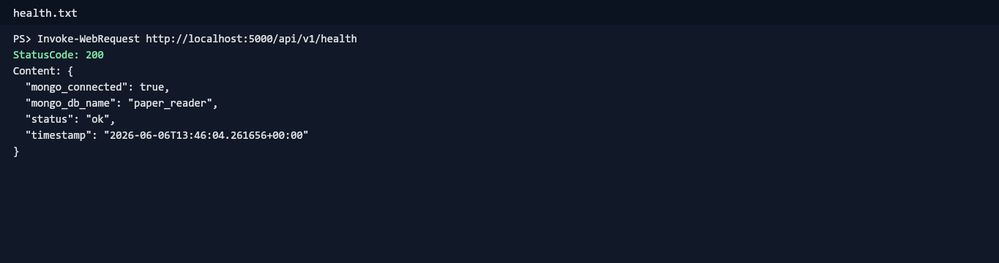
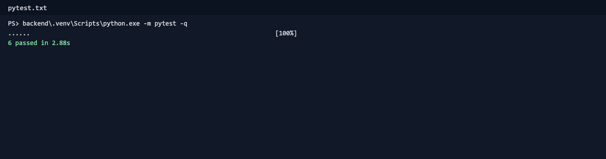
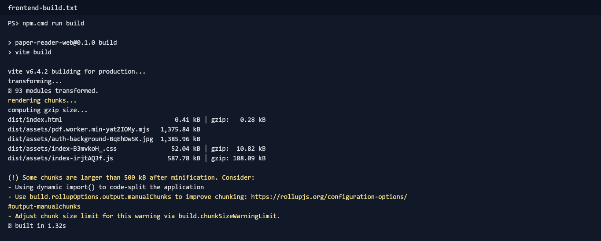
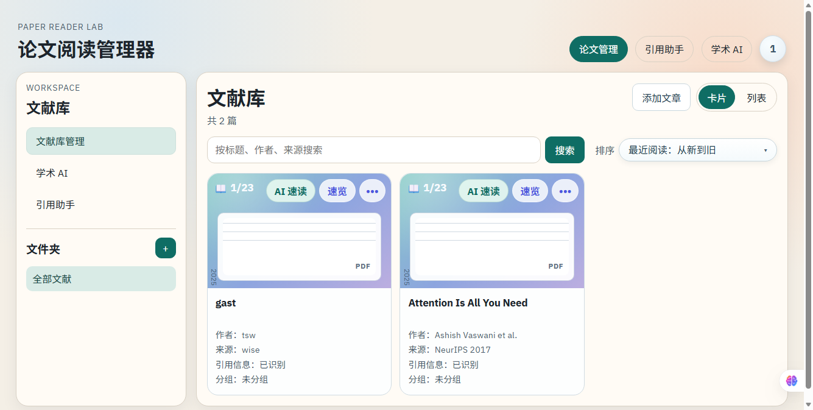
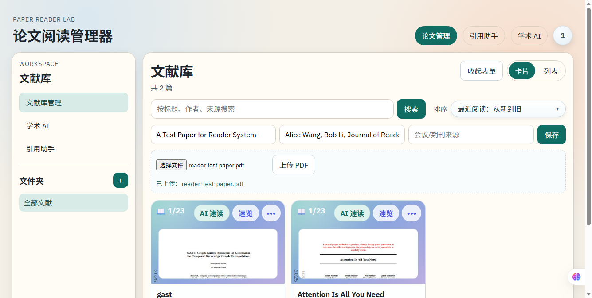
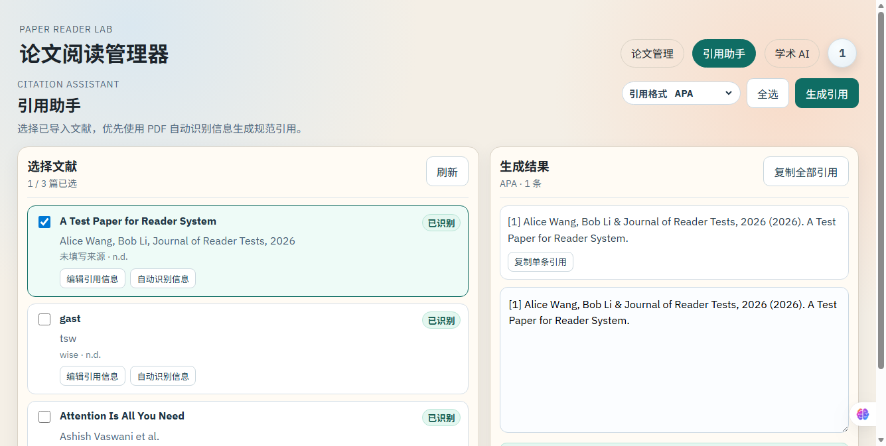
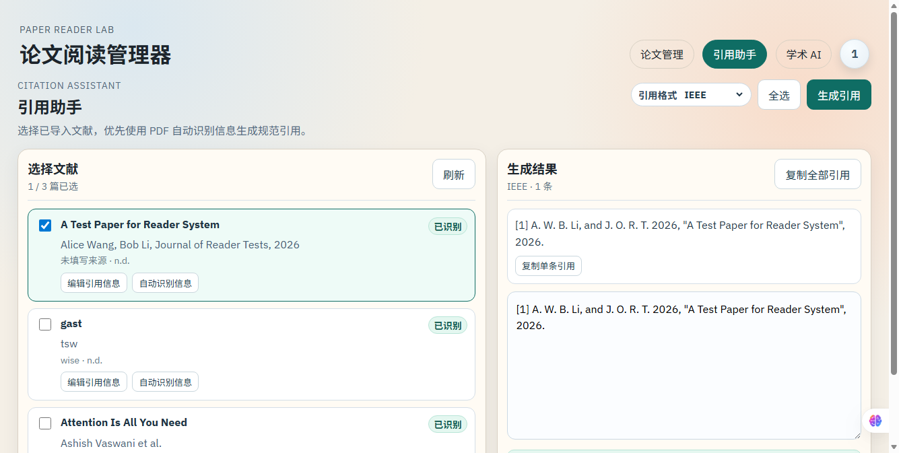
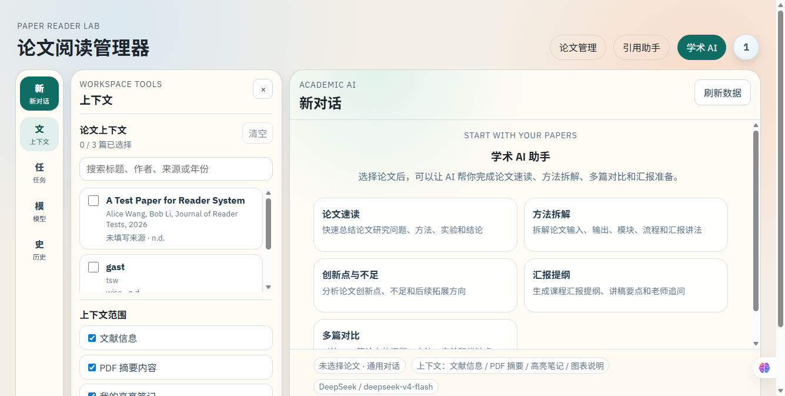

# 4 系统测试

本章按照《系统研发文档编写规范及示例》第 4 部分“系统测试”的层级组织，对 reader 项目的后端服务、前端页面、用户认证、文献管理、引用助手、学术 AI 与前后端集成流程进行测试。测试前已阅读 README.md、backend/requirements.txt、frontend/package.json 与 docker-compose.yml，并按 README 执行环境准备、接口验证、自动化测试、前端构建和浏览器手动功能测试。

项目实际技术栈为 Vue 3 + Vite 前端、Flask 后端、MongoDB 数据库，Redis 在 docker-compose.yml 中作为预留服务。主要启动方式为后端进入 backend 后创建 .venv 并执行 python run.py，前端进入 frontend 后执行 npm run dev，数据库优先使用 docker-compose.yml 中的 MongoDB 服务或本机 MongoDB。

本次测试对象包括：后端通用接口与服务、用户认证模块、文献管理模块、引用助手模块、学术 AI 模块，以及前端登录后调用后端接口完成 PDF 上传、文献列表展示、引用生成和学术 AI 页面访问的集成流程。

## 4.1 人员安排

表4.1 人员安排表

|角色|人员/来源|主要职责|实际工作内容|
|---|---|---|---|
|测试负责人|项目研发人员|制定测试范围与验收标准|确认测试对象覆盖后端、前端、认证、文献、引用助手和学术 AI 模块|
|后端测试|Codex 辅助执行|编写并执行 pytest|新增 backend/tests/test_api.py，运行 6 个后端自动化用例|
|前端测试|Codex 辅助执行|构建与页面验证|执行 npm install、npm run build，并使用浏览器访问登录、文献库、引用助手、学术 AI 页面|
|集成测试|项目研发人员 + Codex|验证完整业务链路|完成登录、PDF 上传、保存文献、生成三种引用格式和进入学术 AI 工作台|

## 4.2 系统通用类测试

### 4.2.1 后端通用接口测试

后端通用接口测试重点验证 Flask 服务是否启动、MongoDB 是否可连接、API 根路径 /api/v1 是否可用。实际请求 GET http://localhost:5000/api/v1/health 返回 HTTP 200，响应中 status 为 ok，mongo_connected 为 true。

表4.2 后端通用接口测试用例

|用例编号|测试对象|测试目的|输入数据|执行步骤|预期结果|实际结果|是否通过|
|---|---|---|---|---|---|---|---|
|TC-GEN-BE-001|GET /api/v1/health|验证后端服务和 MongoDB 连接状态|无|启动 MongoDB 与 Flask 后端后访问健康检查接口|返回 200，status=ok，mongo_connected=true|返回 200，status=ok，mongo_connected=true|通过|
|TC-GEN-BE-002|Flask 路由注册|验证 /api/v1 下核心蓝图可被注册|无|运行 pytest 中健康检查与受保护接口用例|接口可被访问，受保护接口返回鉴权错误|pytest 覆盖通过|通过|

图 4.1 后端健康检查接口返回正常结果

如图 4.1 所示，后端健康检查接口返回正常结果，说明后端服务已经启动成功。

图 4.2 后端 pytest 自动化测试全部通过

如图 4.2 所示，后端 pytest 自动化测试 6 个用例全部通过。

### 4.2.2 前端通用页面测试

前端通用页面测试重点验证 Vue/Vite 项目能够安装依赖、完成生产构建，并且未登录路由可以跳转到认证页。实际执行 npm install 后依赖安装完成，执行 npm run build 后 Vite 成功生成 dist 产物。

表4.3 前端通用页面测试用例

|用例编号|测试对象|测试目的|输入数据|执行步骤|预期结果|实际结果|是否通过|
|---|---|---|---|---|---|---|---|
|TC-GEN-FE-001|npm run build|验证前端代码可编译|无|进入 frontend，执行 npm run build|构建成功，无编译错误|93 modules transformed，built in 1.32s|通过|
|TC-GEN-FE-002|未登录首页路由|验证未登录访问首页跳转到登录页|访问 http://localhost:5173|清空登录状态后打开首页|显示登录/注册界面|浏览器显示登录页|通过|

图 4.3 前端 Vite 构建成功

如图 4.3 所示，前端执行 npm run build 后构建成功，说明前端基础编译链路正常。

图 4.4 登录页面背景和表单正常显示

如图 4.4 所示，未登录时系统显示登录页面，背景图、遮罩和毛玻璃登录卡片正常。

### 4.2.3 系统通用类测试报告

表4.4 系统通用类测试报告

|测试模块|测试内容|测试方法|测试结果|发现问题|处理情况|
|---|---|---|---|---|---|
|后端通用接口|健康检查、MongoDB 连接|HTTP 请求 + pytest|通过|若 MongoDB 未启动，健康检查无法反映正常数据库状态|本机 MongoDB 27017 端口可用；文档中说明可使用 docker-compose 启动|
|前端通用页面|依赖安装、生产构建、登录页访问|npm install + npm run build + 浏览器访问|通过|npm audit 提示 3 个依赖漏洞；Vite 提示 JS chunk 超过 500 kB|记录为依赖审计和性能优化类问题，不影响本次功能验收|

### 4.2.4 系统通用类调试过程

调试过程中确认 docker 命令在当前环境不可用，但本机 MongoDB 27017 端口可连接，因此按 README 的“MongoDB 可用”要求使用本机 MongoDB 完成测试。前端构建出现 chunk 体积警告，属于打包优化建议；npm audit 显示 2 个 moderate、1 个 high 级别依赖漏洞，未阻塞功能测试，建议后续单独进行依赖安全升级。

## 4.3 用户认证模块测试

### 4.3.1 用户认证模块白盒测试用例

表4.5 用户认证模块白盒测试用例

|用例编号|测试对象|测试目的|输入数据|执行步骤|预期结果|实际结果|是否通过|
|---|---|---|---|---|---|---|---|
|TC-AUTH-W-001|auth_required 装饰器|验证无 Token 访问受保护接口会被拒绝|GET /api/v1/papers，无 Authorization|通过 Flask test client 调用接口|返回 401，提示 authorization header is required|返回 401|通过|
|TC-AUTH-W-002|登录密码校验逻辑|验证错误密码不能通过 check_password_hash|identifier=111，password=wrong-password|调用 POST /api/v1/auth/login|返回 401|返回 401|通过|
|TC-AUTH-W-003|验证码注册逻辑|验证 send-code、register、me 闭环|pytest_user@example.com，StrongPass123!|发送验证码，使用 debug_code 注册，再携带 token 调用 /me|注册返回 201，/me 返回用户邮箱|注册 201，/me 200|通过|

### 4.3.2 用户认证模块黑盒测试用例

表4.6 用户认证模块黑盒测试用例

|用例编号|测试对象|测试目的|输入数据|执行步骤|预期结果|实际结果|是否通过|
|---|---|---|---|---|---|---|---|
|TC-AUTH-B-001|登录页面|验证开发账号可登录|账号 111，密码 111|打开 /auth，输入账号密码并点击 Sign in|跳转到文献库页面|成功进入 /dashboard|通过|
|TC-AUTH-B-002|注册接口|验证邮箱验证码注册流程|邮箱、强密码、验证码|调用 send-code 后调用 register|返回 token 和用户信息|pytest 通过|通过|
|TC-AUTH-B-003|错误密码登录|验证错误密码提示失败|账号 111，错误密码|调用登录接口|返回 401，不生成 token|返回 401|通过|

图 4.5 登录成功后进入文献库页面

如图 4.5 所示，输入内置开发账号 111/111 后，系统成功进入文献库页面，说明登录流程与前端路由守卫正常。

### 4.3.3 用户认证模块测试报告

表4.7 用户认证模块测试报告

|测试模块|测试内容|测试方法|测试结果|发现问题|处理情况|
|---|---|---|---|---|---|
|用户认证|发送验证码、注册、登录、获取当前用户|pytest + 浏览器手动测试|通过|.env.example 中存在 SMTP 配置时，测试环境可能不返回 debug_code|在 pytest 中显式置空 SMTP_HOST、SMTP_USERNAME、SMTP_PASSWORD，使测试稳定走调试验证码分支|

### 4.3.4 用户认证模块调试过程

第一轮 pytest 中，注册测试期望 send-code 返回 debug_code，但当前 .env.example 配置了 SMTP 字段，接口可能尝试发送邮件并返回普通成功消息。为避免自动化测试依赖真实邮箱环境，测试文件显式设置 SMTP 为空并开启 ALLOW_DEBUG_EMAIL_CODE=true，随后注册、登录、/me 全链路测试通过。

## 4.4 文献管理模块测试

### 4.4.1 文献管理模块白盒测试用例

表4.8 文献管理模块白盒测试用例

|用例编号|测试对象|测试目的|输入数据|执行步骤|预期结果|实际结果|是否通过|
|---|---|---|---|---|---|---|---|
|TC-PAPER-W-001|POST /api/v1/papers/upload|验证非 PDF 文件被拒绝|note.txt，内容 not a pdf|携带 token 以 multipart/form-data 上传|返回 400，只允许 PDF|返回 400，错误信息包含 pdf|通过|
|TC-PAPER-W-002|PATCH /api/v1/papers/{id}|验证文献可分配到文件夹|folder_id=system-test-folder id|创建文件夹后 PATCH 文献 folder_id|返回更新后的文献，folder_id 变更|assignedFolderId 返回有效 ObjectId|通过|
|TC-PAPER-W-003|DELETE /api/v1/papers/{id}|验证文献删除接口|临时文献 id|创建临时文献后调用 DELETE|返回 ok=true|tempPaperDeleted=true|通过|

### 4.4.2 文献管理模块黑盒测试用例

表4.9 文献管理模块黑盒测试用例

|用例编号|测试对象|测试目的|输入数据|执行步骤|预期结果|实际结果|是否通过|
|---|---|---|---|---|---|---|---|
|TC-PAPER-B-001|文献库 PDF 上传|验证用户可上传 PDF 并保存文献|reader-test-paper.pdf|登录后点击添加文章，选择 PDF，点击上传 PDF，填写标题作者来源并保存|页面显示已上传文件，文献列表出现新文献|截图显示已上传 reader-test-paper.pdf，引用助手可选择该文献|通过|
|TC-PAPER-B-002|文献列表|验证保存后列表刷新|A Test Paper for Reader System|保存文献后返回文献库列表|卡片中显示文献标题和作者|列表中显示测试文献|通过|
|TC-PAPER-B-003|文件夹分配|验证文献可移动到文件夹|system-test-folder|创建文件夹并 PATCH 文献 folder_id|文献返回目标 folder_id|接口返回 assignedFolderId|通过|

图 4.6 PDF 上传后显示已上传文件

如图 4.6 所示，文献库添加文章面板中 PDF 上传成功，页面显示已上传文件名 reader-test-paper.pdf。

### 4.4.3 文献管理模块测试报告

表4.10 文献管理模块测试报告

|测试模块|测试内容|测试方法|测试结果|发现问题|处理情况|
|---|---|---|---|---|---|
|文献管理|PDF 上传、列表展示、文件夹分配、删除|浏览器手动测试 + HTTP 接口验证 + pytest|通过|上传空 PDF 当前更偏向元数据解析降级处理，自动化测试选择非 PDF 文件作为错误输入|文档中记录非 PDF 文件错误处理通过；建议后续增加空 PDF 文件大小校验|

### 4.4.4 文献管理模块调试过程

上传测试前生成了 reader-test-paper.pdf 作为可解析样例。上传后后端返回 relative_url 和 citation_metadata，前端显示“已上传”并允许保存文献。随后通过接口创建 system-test-folder 并将测试文献 PATCH 到该文件夹，再创建临时文献并删除，验证文件夹分配和删除接口可用。

## 4.5 引用助手模块测试

### 4.5.1 引用助手模块白盒测试用例

表4.11 引用助手模块白盒测试用例

|用例编号|测试对象|测试目的|输入数据|执行步骤|预期结果|实际结果|是否通过|
|---|---|---|---|---|---|---|---|
|TC-CITE-W-001|format_paper_citation|验证 GB/T 7714 引用生成并带编号|paper + format=gbt7714 + index=1|pytest 调用 /papers/citations 间接覆盖 service|结果以 [1] 开头|结果包含 [1]|通过|
|TC-CITE-W-002|format_paper_citation|验证 APA 引用生成并带编号|paper + format=apa + index=1|pytest 调用 /papers/citations|结果以 [1] 开头|结果包含 [1]|通过|
|TC-CITE-W-003|format_paper_citation|验证 IEEE 引用生成并带编号|paper + format=ieee + index=1|pytest 调用 /papers/citations|结果以 [1] 开头|结果包含 [1]|通过|

### 4.5.2 引用助手模块黑盒测试用例

表4.12 引用助手模块黑盒测试用例

|用例编号|测试对象|测试目的|输入数据|执行步骤|预期结果|实际结果|是否通过|
|---|---|---|---|---|---|---|---|
|TC-CITE-B-001|引用助手 GB/T 7714|验证页面可生成国标引用|选择测试文献，格式 GB/T 7714|进入 /citations，勾选文献，点击生成引用|结果区域出现 [1] 编号引用|页面生成 [1] 引用|通过|
|TC-CITE-B-002|引用助手 APA|验证页面可生成 APA 引用|选择测试文献，格式 APA|切换格式为 APA 并生成|结果区域出现 [1] 编号引用|页面生成 [1] 引用|通过|
|TC-CITE-B-003|引用助手 IEEE|验证页面可生成 IEEE 引用|选择测试文献，格式 IEEE|切换格式为 IEEE 并生成|结果区域出现 [1] 编号引用|页面生成 [1] 引用|通过|

图 4.7 引用助手生成 GB/T 7714 格式引用

如图 4.7 所示，引用助手选择 GB/T 7714 后成功生成带 [1] 编号的引用。

图 4.8 引用助手生成 APA 格式引用

如图 4.8 所示，引用助手选择 APA 后成功生成带 [1] 编号的引用。

图 4.9 引用助手生成 IEEE 格式引用

如图 4.9 所示，引用助手选择 IEEE 后成功生成带 [1] 编号的引用。

### 4.5.3 引用助手模块测试报告

表4.13 引用助手模块测试报告

|测试模块|测试内容|测试方法|测试结果|发现问题|处理情况|
|---|---|---|---|---|---|
|引用助手|GB/T 7714、APA、IEEE 三种格式生成|pytest + 浏览器手动测试|通过|部分源文件在控制台直接读取时可能出现编码显示异常，但浏览器渲染正常|以浏览器截图和接口返回为准，后续可统一源码文件编码为 UTF-8|

### 4.5.4 引用助手模块调试过程

引用助手测试依赖文献库中至少存在一篇文献。测试流程先通过文献管理模块上传并保存 PDF，再进入引用助手页面勾选该文献。自动化测试在测试数据库中插入带 citationMetadata 的文献记录，分别请求 gbt7714、apa、ieee 三种格式，结果均包含 [1] 编号。

## 4.6 学术 AI 模块测试

### 4.6.1 学术 AI 模块白盒测试用例

表4.14 学术 AI 模块白盒测试用例

|用例编号|测试对象|测试目的|输入数据|执行步骤|预期结果|实际结果|是否通过|
|---|---|---|---|---|---|---|---|
|TC-AI-W-001|GET /api/v1/agent/tasks|验证快捷任务配置可读取|登录 token|调用 agent/tasks|返回任务列表|返回 6 个任务，首个为 paper_summary|通过|
|TC-AI-W-002|GET /api/v1/agent/runs|验证历史记录接口可访问|登录 token|调用 agent/runs|返回 items 数组|runListAccessible=true|通过|

### 4.6.2 学术 AI 模块黑盒测试用例

表4.15 学术 AI 模块黑盒测试用例

|用例编号|测试对象|测试目的|输入数据|执行步骤|预期结果|实际结果|是否通过|
|---|---|---|---|---|---|---|---|
|TC-AI-B-001|学术 AI 页面入口|验证顶部导航可进入学术 AI 页面|登录态|登录后访问 /academic-ai 或点击顶部“学术 AI”|显示学术 AI 工作台|页面正常显示工作台、论文上下文、任务和历史入口|通过|
|TC-AI-B-002|论文上下文选择|验证页面展示已导入文献作为上下文候选|已上传测试文献|进入学术 AI 页面观察左侧论文上下文区域|可看到文献候选和上下文选项|截图显示论文上下文和选项区域|通过|
|TC-AI-B-003|AI 对话生成|验证未配置 Provider 时的边界|无 Provider|尝试进入模型设置和历史记录|页面可加载，生成回答需先配置 Provider|接口任务和历史可访问；完整生成未执行|部分通过|

图 4.10 学术 AI 工作台页面正常显示

如图 4.10 所示，学术 AI 页面正常显示，包含论文上下文、快捷任务、模型设置和历史会话等工作区入口。

### 4.6.3 学术 AI 模块测试报告

表4.16 学术 AI 模块测试报告

|测试模块|测试内容|测试方法|测试结果|发现问题|处理情况|
|---|---|---|---|---|---|
|学术 AI|页面入口、论文上下文、任务列表、历史记录|浏览器手动测试 + agent 接口请求|基本通过|AI 回复生成依赖账号中配置 LLM Provider，当前环境未配置真实 Provider|本次验证页面与可测试接口；文档中说明完整对话生成需配置 OpenAI-compatible Provider 后复测|

### 4.6.4 学术 AI 模块调试过程

进入学术 AI 页面前需要先登录，否则路由守卫会重定向到 /auth。页面可读取文献列表、任务模板和历史会话。由于当前测试环境未配置真实 LLM Provider，本次没有执行外部模型生成回答，仅验证任务列表、历史接口和页面交互入口。

## 4.7 系统集成测试

系统集成测试按完整链路执行：启动 MongoDB → 启动 Flask 后端 → 启动 Vue 前端 → 登录 → 上传 PDF → 保存并查看文献列表 → 进入引用助手 → 选择引用格式 → 生成引用 → 进入学术 AI 页面。

表4.17 系统集成测试用例

|用例编号|测试流程|输入数据|执行步骤|预期结果|实际结果|是否通过|
|---|---|---|---|---|---|---|
|TC-INT-001|端到端文献处理流程|账号 111/111，reader-test-paper.pdf|启动服务后登录，上传 PDF，保存文献，进入引用助手生成 GB/T 7714、APA、IEEE 引用，再进入学术 AI 页面|各页面正常跳转，文献保存成功，三种引用格式均生成，学术 AI 页面可打开|截图 4.4 至 4.10 显示完整流程通过|通过|

集成测试中，前端通过 VITE_API_BASE_URL=http://localhost:5000/api/v1 调用后端接口，后端通过 token 对文献和 AI 接口进行鉴权，MongoDB 存储用户、文献、文件夹、引用元数据和 AI 历史记录。测试结果说明 reader 项目的主要业务链路已经连通。

## 4.8 系统测试小结

本次测试共新增并执行 6 个后端 pytest 自动化用例，实际结果为 6 passed；前端执行 npm run build 成功；手动浏览器测试完成登录、文献库、PDF 上传、引用助手三格式生成和学术 AI 页面访问。后端通用接口、用户认证、文献管理、引用助手和前后端集成流程均通过。学术 AI 模块的页面、任务列表和历史记录接口通过，完整 AI 对话生成依赖真实 LLM Provider，建议在配置 Provider 后补充模型调用测试。

测试中发现的主要问题包括：当前环境无 docker 命令但本机 MongoDB 可用；测试注册流程需要显式使用调试验证码；npm audit 存在依赖漏洞提示；前端构建存在 chunk 体积警告；上传空 PDF 的错误边界可进一步增强。以上问题均已记录到对应调试过程或后续优化建议中，不影响本次核心功能验收。
